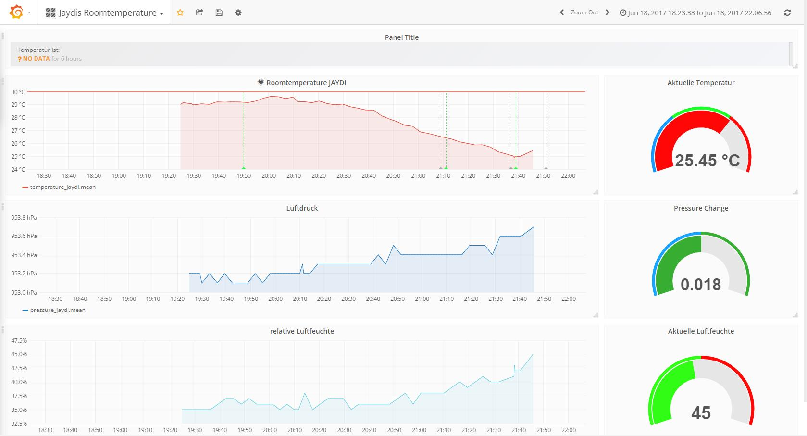

# iot

Repsitory conainting all files neccessary to complete the summerschool at kiz Ulm University.
The summerschool targets IT-Specialist appretinces at the datacenter of Ulm University. It should always cover subjects that are not covered by the curriculum of the trade school they are going to. So this year we wanted to try something utterly new by introducing them to the big new buzzword of *internet of things*, specifically *LoRaWan* and *TheThingsNetwrk*.
They had to build a LoRaWan Weatherstation that pushes als measurements to TTN. Aferwards these measurements had to be fetched via node-red or a tool of their choice and thereafter visualized via a suitable tool (grafana + influx in this example).
This project has been conducted under supervision of Simon Lueke of Studierendenwerk Ulm and me.

## Things needed to recreate this project / Prerequisites
### Infrastructure
* Server / Computer connected to the internet with at least 4GB Ram (for Node-Red, InfluxDB and Grafana for visualization). We recommend a blank machine so your students can install everything (including linux) by themselfes.
* LoRaWan coverage! If not available, you can either buy a gateway (expensive) or [build one yourself](https://github.com/JaapBraam/LoRaWanGateway). 
### Modules 
* Adafruit Feather M0 Lora (RFM95 for eu Frequencies)
* A Breadboard
* BME280 Temperaturesensor (includes humidity + pressure)
* TEEMT6000 Ambient Light Sensor
* Soil humidity sendor
### Electircal components
* 5 LEDs per Team
* Some arbitraty NTCs / PTCs ( equal number of both)
* Some arbitrary resistors ( 100, 4k7, 100k, 10k, 1k) for every team. 
  *Important*: Choose carbon composite resistors for the electrotechnics presentation as they are less temperature-stable. This way you can show the temperature dependency of resistors.
* Some arbitrary resistors, this time metal foil resistors
* Jumper-Wires (best get them from China via AliExpress)

## Libraries / Tutorials used
* [Adafruit BME280](https://github.com/adafruit/Adafruit_BME280_Library)
* [Adafruit TEEMT600](https://learn.sparkfun.com/tutorials/temt6000-ambient-light-sensor-hookup-guide)
* [Sparkfun Soil Moisture Sensor](https://learn.sparkfun.com/tutorials/soil-moisture-sensor-hookup-guide)
* [LMIC by matthijskooijman](https://github.com/matthijskooijman/arduino-lmic)

## Filestructure

* *src* - contains the sketchfiles
* *pres* - contains the presentations held for the trainees (german... will maybe be translated later)
* *node-red-flows* - self explanatory
* *grafana-dashboard* - self explanatory
